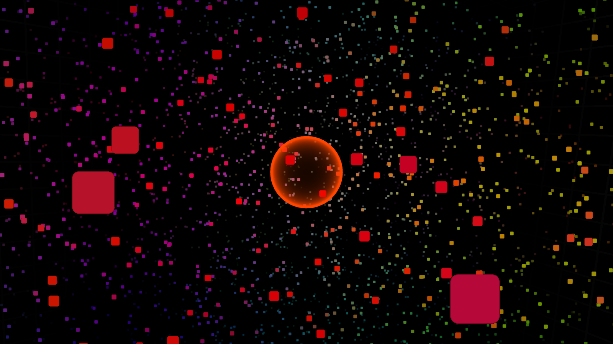

# Zor.bio

Absorb the Orbs!

## Install

Install package dependancies:

    dnf install nodejs npm js-dev fedora-packager @development-tools

After cloning the repository, cd into it and install dependencies:

    bower install
    npm install

Edit `common/config.js` to your heart's content.

## Hacking

To launch a local server:

    npm start

Changes to JS in `server/` requires a server restart, but changes in `client/`
doesn't.

## Builds

To perform a production build:

    npm run build

This will build all the client assets into a single HTML file
(`dist/index.html`) with all CSS and JavaScript inlined and minified.  Images
are still loaded via HTTP requests.

Once a build has eben performed, the server can be launched in production mode,
which really just causes the server to serve up `dist/` instead of `client/`.
Here's the command:

    npm run start-prod
